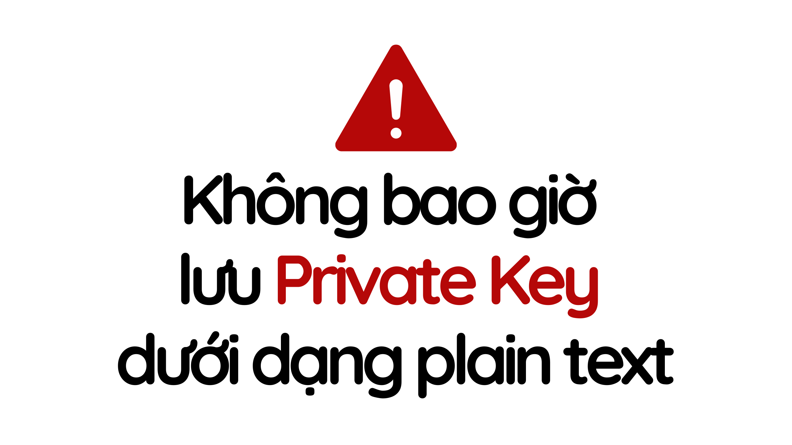

<div align="center">

<h1>Foundry Basics Course</h1>

<strong>Học cách phát triển Smart Contract Solidity bằng thư viện Foundry</strong>

<p align="center">
<a href="https://www.youtube.com/@VBIAcademy">
        </a>
</p>
Chào mừng bạn đến với repository của khoá học Foundry Basics. <br/> Khoá học này được phát triển bởi <a href="https://www.youtube.com/@VBIAcademy">VBI Academy</a> và <a href="https://www.terrancrypt.com/">Terran Crypt</a>.

</div>

---
> Nội dung trong khoá học này đã được sự cho phép chọn lọc và dịch thuật từ các khoá học được phát triển và giảng dạy bởi [Cyfrin Updraft](https://updraft.cyfrin.io/) và [Patrick Collins](https://www.youtube.com/@PatrickAlphaC).
---

## Mở đầu

Tiếp nối khoá học [Solidity Basics](https://github.com/openedu101/solidity-basics), trong khoá học này chúng ta sẽ học cách sử dụng Foundry cho việc xây dựng smart contract Solidity. Hãy chắc chắn rằng bạn đã có kiến thức cơ bản về Blockchain và Solidity trước khi chúng ta học khoá này.

Group hỗ trợ: <a href="https://discord.gg/htjprg2Puy" style="text-decoration: underline;">Solidity Developer Vietnam</a>

## Section 1: Local Development w/ Foundry

Foundry là một bộ công cụ phát triển smart contract cho Ethereum, được viết bằng Rust. Nó được thiết kế để hỗ trợ việc phát triển, kiểm thử và triển khai smart contract Solidity một cách hiệu quả.

- Các thành phần chính:

  - Forge: Công cụ kiểm thử và biên dịch smart contract
  - Cast: Công cụ dòng lệnh để tương tác với blockchain Ethereum
  - Anvil: Node Ethereum cục bộ để phát triển và kiểm thử

- Ưu điểm chính:

  - Tốc độ: Được viết bằng Rust, Foundry thực hiện các tác vụ như biên dịch và kiểm thử nhanh hơn so với nhiều công cụ khác.
  - Kiểm thử mạnh mẽ: Hỗ trợ viết và chạy các bài kiểm tra bằng Solidity, cho phép kiểm tra kỹ lưỡng logic của smart contract.
  - Tích hợp với các công cụ khác: Dễ dàng tích hợp với các công cụ phát triển phổ biến khác.
  - Debugger tích hợp: Giúp dễ dàng tìm và sửa lỗi trong smart contract.

- Cách sử dụng:

  - Viết smart contract bằng Solidity
  - Sử dụng Forge để biên dịch và kiểm thử contract
  - Sử dụng Cast để tương tác với blockchain
  - Sử dụng Anvil để chạy một node Ethereum cục bộ cho phát triển

### Cài đặt Foundry & Thiết lập môi trường phát triển


- [Visual Studio Code](https://code.visualstudio.com/)
- [Git](https://git-scm.com/)
- [Foundry Documentation](https://book.getfoundry.sh/)
- [Solidity - VSCode Extension](https://marketplace.visualstudio.com/items?itemName=JuanBlanco.solidity)

### Forge & Anvil

Code trong phần này sử dụng contract SimpleStorage trong khoá Solidity Basics: [tại đây](https://github.com/openedu101/solidity-basics/tree/01-remix-simple-storage)

Final Code: [tại đây](https://github.com/openedu101/foundry-basics/tree/01-simple-storage)

- Compile contract:

```
forge compile
```

- Format code:

```bash
forge fmt
```

- Run local Anvil chain:

```bash
anvil
```

#### Deploy contract lên mạng local

Có 2 cách để deploy:

- Với `create`

```bash
forge create SimpleStorage --rpc-url http://127.0.0.1:8545 --interactive
```

```bash
forge create SimpleStorage --rpc-url http://127.0.0.1:8545 --private-key 0xac0974bec39a17e36ba4a6b4d238ff944bacb478cbed5efcae784d7bf4f2ff80
```

Cách sử dụng `--interactive` tốt hơn, không lưu private key dưới dạng plain text trong terminal.

- Với `script`

```bash
forge script script/DeploySimpleStorage.s.sol --rpc-url http://127.0.0.1:8545 --broadcast --private-key 0xac0974bec39a17e36ba4a6b4d238ff944bacb478cbed5efcae784d7bf4f2ff80
```



#### Bảo mật private key với `cast wallet`

- Tạo account mới để lưu trữ private key: 

```bash
cast wallet import <ACCOUNT_NAME> --interactive
```

- Xem danh sách các account đã tạo
```bash
cast wallet list
```

#### Giải thích deploy transactions

- Chuyển hex value thành decimal value: 
```bash
cast --to-base {hex} dec
```

#### Tương tác với contract đã được deploy

- Send transaction:
```bash
cast send <CONTRACT_ADDRESS> <FUNCTION_SIGNATURE> <ARGS> --rpc-url <YOUR_RPC_URL> --account <ACCOUNT_NAME>
```

- Call transaction:
```bash
cast call <CONTRACT_ADDRESS> <FUNCTION_SIGNATURE> <ARGS> --rpc-url <YOUR_RPC_URL>
```

#### Lấy RPC-URL trên Alchemy
- [Alchemy](https://www.alchemy.com/)

#### Deploy và verify contract trên Sepolia Testnet
- [Sepolia Etherscan](https://sepolia.etherscan.io/)
  
- Ví dụ về contract đã được deploy và verify: [Simple Storage](https://sepolia.etherscan.io/address/0xee38c811f888a24b962c17539285c2daaad5bba8#code)

- Sử dụng ENV file để bảo mật các giá trị riêng tư: [ENV Example](https://github.com/openedu101/foundry-basics/blob/01-simple-storage/.env.example)

- Sử dụng ENV Variables trong terminal: 

```bash
source .env
```

```bash
forge script script/DeploySimpleStorage.s.sol --rpc-url ${SEPOLIA_RPC_URL} --account <ACCOUNT_NAME> --broadcast 
```

- Verify contract:

```bash
forge verify-contract <CONTRACT_ADDRESS> <PATH>:<CONTRACT_NAME> --rpc-url ${SEPOLIA_RPC_URL} --etherscan-api-key ${ETHERSCAN_API_KEY}
```

- Verify contract khi deploy contract:
```bash
forge script script/DeploySimpleStorage.s.sol --rpc-url ${SEPOLIA_RPC_URL} --account <ACCOUNT_NAME> --broadcast  --verify --etherscan-api-key ${ETHERSCAN_API_KEY}
```

Lưu ý là nếu muốn verify contract trong khi deploy thì chỉ có thể sử dụng script bởi vì khi deploy thì script sẽ chứa luôn đường dẫn đến file của contract.

#### Makefile

- [Makefile Tutorial](https://makefiletutorial.com/)
- [Cài Makefile cho Windows](https://medium.com/@samsorrahman/how-to-run-a-makefile-in-windows-b4d115d7c516)

## Section 2: Smart Contracts Testing w/ Foundry

Code khởi đầu sử dụng contract `Crowdfunding` trong khoá Blockchain Basics: [tại đây](https://github.com/openedu101/solidity-basics/blob/04-decentralized-crowdfunding-final-code)

Final code: [tại đây](https://github.com/openedu101/foundry-basics/tree/02-decentralized-crowdfunding)

Contract đã được deploy và verify: [tại đây](https://sepolia.etherscan.io/address/0x0fbd1bcb43b42f8cbc1349d012cbb940bf8cf10b)

### Testing smart contracts là gì?

Testing smart contract Solidity là quá trình kiểm tra, xác minh tính đúng đắn, an toàn và hiệu quả của mã nguồn smart contract được viết bằng ngôn ngữ lập trình Solidity. Quá trình này bao gồm việc viết và chạy các tập lệnh kiểm thử (test scripts) để mô phỏng các tình huống khác nhau mà hợp đồng thông minh có thể gặp phải trong thực tế. Mục tiêu của việc testing là đảm bảo rằng smart contract hoạt động chính xác theo yêu cầu, không có lỗi, và an toàn trước các lỗ hổng bảo mật.

Xem top những dự án blockchain/web3 bị hack: https://rekt.news/leaderboard/

### Tại sao cần phải testing smart contract Solidity?

1. Ngăn ngừa lỗi: Smart contract quản lý các giao dịch và tài sản trên blockchain, nơi mà bất kỳ lỗi nào cũng có thể gây ra thiệt hại tài chính lớn. Testing giúp phát hiện và sửa chữa các lỗi trong mã nguồn trước khi triển khai lên blockchain.

3. Đảm bảo bảo mật: Một khi smart contract đã được triển khai, nó không thể bị thay đổi. Nếu tồn tại lỗ hổng bảo mật, kẻ tấn công có thể lợi dụng để chiếm đoạt tài sản hoặc phá hoại hệ thống. Testing giúp phát hiện và loại bỏ các lỗ hổng này trước khi hợp đồng được sử dụng thực tế.

4. Xác minh tính đúng đắn của logic: Smart contract thường chứa các logic phức tạp để thực hiện các chức năng như quản lý tài sản, thực hiện giao dịch, hoặc tuân thủ các quy định. Testing giúp xác minh rằng logic này hoạt động đúng như mong đợi trong mọi tình huống, bao gồm cả các tình huống ngoại lệ.

5. Tối ưu hóa chi phí gas: Việc thực thi smart contract trên blockchain yêu cầu trả phí gas. Testing có thể giúp phát hiện các đoạn mã không tối ưu, từ đó giảm chi phí thực thi hợp đồng.

6. Tuân thủ các tiêu chuẩn và quy định: Một số smart contract cần phải tuân thủ các tiêu chuẩn cụ thể (ví dụ như ERC-20 cho token trên Ethereum). Testing giúp đảm bảo rằng hợp đồng đáp ứng các tiêu chuẩn này.

7. Tránh chi phí phát sinh không cần thiết: Việc sửa lỗi sau khi smart contract đã được triển khai có thể rất tốn kém, do phải triển khai lại hợp đồng và chi trả thêm phí gas. Testing giúp giảm thiểu khả năng xảy ra những sai lầm tốn kém này.

8. Tăng độ tin cậy: Một smart contract đã được kiểm tra kỹ lưỡng sẽ tạo dựng được sự tin tưởng từ phía người dùng, nhà đầu tư, và các bên liên quan khác. Điều này là rất quan trọng trong môi trường blockchain, nơi mà niềm tin vào tính toàn vẹn và an toàn của mã nguồn là yếu tố sống còn.

Việc testing smart contract Solidity là bước thiết yếu để đảm bảo rằng hợp đồng hoạt động đúng và an toàn, góp phần bảo vệ tài sản và xây dựng niềm tin trong cộng đồng người dùng blockchain.

### Các loại testing smart contract cơ bản

1. Unit:
   - Kiểm tra một phần cụ thể trong code.
2. Integration:
   - Kiểm tra hoạt động của code với các phần khác trong dự án.
3. Forked:
   - Kiểm tra code với giả lập môi trường thực tế.
4. Staging:
   - Kiểm tra code trong một môi trường thực tế (testnet) nhưng không phải production (mainnet).

### Dependencies (Phần Phụ Thuộc)

Hoặc mình hay gọi là Libraries, hoặc một Project,... sao cũng được.

#### Install
Để cài đặt một dependency thì bạn hãy chạy lệnh `forge install`. Tuy nhiên, bạn nên nhớ chỉ định version để code trong phần này và code của bạn match với nhau. Vì sau này có thể có nhiều bản cập nhận cho dependencies chúng ta muốn cài đặt, và nếu không chỉ định version thì mặc định cài bản mới nhất.

```bash
forge install <GITHUB_LINK>:<VERSION> --no-commit
```

- [Chainlink](https://github.com/smartcontractkit/chainlink)
- [OpenZeppelin](https://github.com/OpenZeppelin/openzeppelin-contracts)
- [Foundry DevOps](https://github.com/Cyfrin/foundry-devops)
  
#### Remappings

Docs: [tại đây](https://book.getfoundry.sh/projects/dependencies?highlight=remappings#remapping-dependencies)

Thư viện `forge` có thể tự remap dependencies (ánh xạ lại các phụ thuộc) để import links gọn hơn. Bằng cách chạy `forge remappings` bạn có thể nhìn thấy những remap tự động.

```bash
$ forge remappings
```

Kết quả:
```
forge-std/=lib/forge-std/src/
```

Remappings trên có ý nghĩa là:
- Để import từ `forge-std` chúng ta có thể ghi: 
  -  `import "forge-std/Contract.sol";` chứ không cần phải `import "lib/forge-std/src/Contract.sol`;

Bạn có thể tự custom remapping những phần phụ thuộc mà bạn muốn bằng cách thêm trường `remappings` vào `foundry.toml`:

```
remappings = ["@chainlink=lib/chainlink", "@solmate-utils/=lib/solmate/src/utils/"]
```

### Forge Test

#### Thiết lập Test File

- [Document](https://book.getfoundry.sh/forge/tests)

Nếu bạn chưa quen với việc testing (trong bất kỳ ngôn ngữ hay công nghệ nào). Thì bên trong test file sẽ có các function (hoặc method) được gọi là những **test case**. 

Trong Foundry, các Test File sẽ được đặt trong folder `test/` và được kết thúc bằng `.t.sol`.

Bất kỳ contract nào có tên khởi đầu với chữ `test` sẽ được thư viện forge xem là một test case và chạy nó.

##### Run Test

Để chạy test bạn sử dụng command:
```
forge test
```

Để chạy một test case nhất định:

```
forge test --match-test <TEST_NAME>
```

Alias: --mt

Để chạy một file test nhất định:
```
forge test --math-path <PATH_TO_FILE>
```

Alias: --mp

#### Logs

Nếu trong test file có function `console.log()` thì có thể dùng để xem log ra những biến (hoặc kết quả) mà mình muốn.

Để xem log thì hãy thêm cờ `-v` vào lệnh commnand `forge test`. Dưới đây là các level logs, mỗi level cao hơn sẽ có các tính năng của các level thấp hơn.

- Mức 2 ( -vv) : Logs được emmitted khi chạy tests. 
- Mức 3 ( -vvv) : Stack traces (như mình hay nói là "luồng chạy") sẽ được hiển thị cho những test case nào thất bại.
- Mức 4 ( -vvvv) : Hiển thị stack traces cho mọi luồng chạy, bao gồm setup, test thành công và test thất bại.

### Fork Test

- [Document](https://book.getfoundry.sh/forge/fork-testing)

Fork Test hay còn gọi là mô phỏng môi trường. Giúp việc chạy test trên một bản sao ảo của blockchain tại một thời điểm cụ thể. Điều này giúp bạn có một môi trường testing gần giống với thực tế.

Khi mà chúng ta chạy lệnh `forge test` bên trên, forge sẽ tự động tạo cho chúng ta một môi trường local Anvil Chain và chạy những test case của chúng ta trên đó. 

Để chạy fork test chúng ta chỉ cần thêm flag `--fork-url` và khai báo RPC_URL của EVM chain mà bạn muốn.

```
forge test --fork-url <RPC_URL>
```

Nếu chúng ta chạy fork test thì chúng ta có thể tương tác với những hợp đồng đã được deploy. Còn nếu không? những hợp đồng chúng ta cần dưới local để tương tác thì chúng ta có thể thông qua một **Mock Contract**.

### Mock Contract

Mock Contract tạo ra một phiên bản giả lập của một contract nào đó mà chúng ta cần. Mock contract mô phỏng hành vi của contract thật (có thể đã được deploy hoặc của một hệ thống khác).

Mock contract giúp chúng ta cô lập unit test dưới local, chỉ tập trung test một test case duy nhất mà không ảnh hưởng nhiều bởi các yếu tố bên ngoài.

Nếu sử dụng mock contract được, thì chúng ta không cần chạy fork test với hợp đồng đã được deploy, giúp tiết kiệm thời gian.

Mock contract giúp tạo ra những tình huống mà hiện tại trong thực tế, contract được mock (được deploy) không tồn tại tình huống đó để chúng ta chạy test case cho tình huống đó. Ví dụ: giá thực tế của ETH là 3000USD/ETH, nhưng chúng ta muốn test trường hợp giá ETH là 30,000USD/ETH thì chúng ta sử dụng mock test cho các aggregator contract thì mới làm được điều đó.

## Coverage (độ bao phủ test)

Chạy lệnh

```
forge coverage
```

giúp chúng ta đo lường mức độ bao phủ của các test case đối với toàn bộ mã nguồn.

- Line Coverage: Số dòng mã được thực thi.
- Branch coverage: Số nhánh điều kiện được kiểm tra.
- Function coverage: Số hàm được gọi trong quá trình kiểm thử.

Nếu quá khó để handle thì chúng ta chỉ cần quan tâm đến function coverage, test đầy đủ hết đầu ra và đầu vào của một function.

